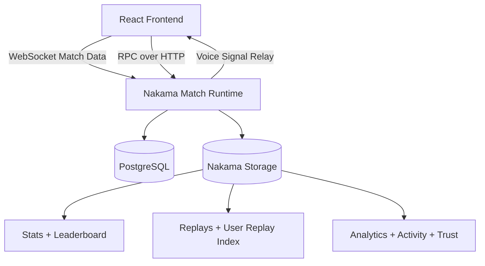

# LILA

Server-authoritative multiplayer Tic-Tac-Toe built with Nakama, PostgreSQL, React, TypeScript, Vite, and React Native.

This document is the primary onboarding and maintenance guide for the codebase.

## Quick Start (5 Minutes)

```bash
make local-up
make smoke
cd frontend && npm run dev
```

Then open `http://localhost:3000`.

Note: `make smoke` expects the Nakama stack to be healthy first. It runs an integration test against the live backend, so it may take a little longer than a normal unit test.

For the mobile app:

```bash
cd LIVAMobile
npm install
npm run start
```

## Table Of Contents

- [Project Intent](#project-intent)
- [Whats Working Today](#whats-working-today)
- [Screenshots](#screenshots)
- [Current Product Surface](#current-product-surface)
- [Architecture At A Glance](#architecture-at-a-glance)
- [Repository Map](#repository-map)
- [Backend Contracts](#backend-contracts)
- [Local Development](#local-development)
- [Commands](#commands)
- [Testing Strategy](#testing-strategy)
- [Production Quality Gates](#production-quality-gates)
- [Design System Notes](#design-system-notes)
- [Known Limitations](#known-limitations)
- [Extension Workflow](#extension-workflow)
- [Deployment Notes](#deployment-notes)
- [Troubleshooting](#troubleshooting)

## Project Intent

LILA is designed so gameplay truth always lives on the server:

- legal/illegal moves
- turn order and timers
- wins/draws/rematches
- AI behavior
- anti-cheat trust scoring
- replay and analytics persistence

The frontend sends intents and renders canonical state from Nakama.

## Whats Working Today

The current codebase supports:

- real-time multiplayer Tic-Tac-Toe on the web client
- React Native mobile client backed by the same Nakama runtime
- quick match and private room flows
- AI matches
- replay viewing and analytics dashboards
- leaderboard and player stats retrieval
- voice signaling support in the web game flow
- Playwright browser coverage with screenshot baselines
- integration smoke testing against a live local Nakama stack
- frontend and mobile lint/type-check gates

## Screenshots

Add project screenshots here when publishing or sharing the repo. Recommended set:

- web login
- web lobby
- web game board
- mobile login
- mobile game board

Current visual regression baselines are generated under `frontend/tests/e2e/app.spec.ts-snapshots/`.

## Current Product Surface

The repository currently ships two client surfaces:

- `frontend/`: the primary web app built with React, TypeScript, Vite, Tailwind, Framer Motion, and Playwright
- `LIVAMobile/`: the mobile app built with React Native, React Navigation, Zustand, and the same Nakama backend

Recent UI work introduced a premium Tic-Tac-Toe visual system shared conceptually across both surfaces:

- dark charcoal stage backgrounds
- soft off-white elevated cards
- blue `X` and warm orange `O` accent language
- rounded “phone-like” panels and pill buttons
- redesigned login, lobby, game, leaderboard, analytics, replay, and settings screens
- stronger accessibility and visual regression coverage on the web app

## Naming Note

You may notice a naming mismatch in the repository:

- repo/workspace folder: `LIVA`
- product title in the clients: `LILA`
- mobile package name: `liva-mobile`

This README keeps the user-facing product name as `LILA` while referencing actual filesystem/package names where needed.

## Architecture At A Glance



## Repository Map

```text
LIVA/
├── frontend/
│   ├── src/
│   │   ├── components/      # UI primitives and game widgets
│   │   ├── context/         # Zustand stores
│   │   ├── hooks/           # Connection, timer, preferences hooks
│   │   ├── lib/             # Utility, logging, feedback helpers
│   │   ├── pages/           # Route-level pages (lobby/game/replay/analytics)
│   │   ├── services/        # Nakama wrapper (RPC + socket)
│   │   └── types/           # Frontend contract types
│   ├── scripts/smoke-test.mjs
│   ├── tests/e2e/           # Playwright browser + snapshot coverage
│   └── package.json
├── LIVAMobile/
│   ├── src/
│   │   ├── components/      # Mobile cards, buttons, board, overlays
│   │   ├── hooks/           # Nakama + timer hooks
│   │   ├── screens/         # Auth, lobby, game, leaderboard, analytics, replay, settings
│   │   ├── services/        # Mobile Nakama wrapper
│   │   ├── store/           # Zustand stores
│   │   ├── theme/           # Shared color, spacing, shadow tokens
│   │   ├── types/           # Mobile contract types
│   │   └── utils/           # Responsive helpers and storage
│   └── package.json
├── nakama/
│   ├── config/local.yml
│   ├── data/modules/
│   │   ├── runtime.ts       # Main server gameplay engine
│   │   ├── scripts/         # Runtime validation + AI/anti-cheat tests
│   │   └── package.json
│   └── docker-compose.yml
├── deploy/docker-compose.prod.yml
├── docs/
│   ├── openapi.yaml
│   └── architecture.mmd
├── Makefile
└── deploy.sh
```

## Backend Contracts

### Match Op Codes

- Server -> client: `GAME_STATE`, `GAME_START`, `GAME_OVER`, `PLAYER_JOINED`, `PLAYER_LEFT`, `WAITING`, `TIMER_UPDATE`, `VOICE_SIGNAL`, `ERROR`
- Client -> server: `MAKE_MOVE`, `MAKE_QUANTUM_MOVE`, `REQUEST_REMATCH`

### RPC Endpoints

- `find_or_create_match`
- `create_private_match`
- `join_private_match`
- `get_leaderboard`
- `get_player_stats`
- `get_match_replay`
- `get_analytics`
- `get_live_activity`

Source of truth: `docs/openapi.yaml`.

### Storage Collections

- `rooms`
- `stats`
- `leaderboard`
- `replays`
- `user_replays`
- `analytics`
- `activity`
- `trust`

## Local Development

### Prerequisites

- Node.js 20+
- npm 10+
- Docker Desktop (daemon running)

### 1. Configure env files

```bash
cp frontend/.env.example frontend/.env.local
cp nakama/.env.example nakama/.env
```

### 2. Build runtime module

```bash
cd nakama/data/modules
npm install
npm run build
```

### 3. Start backend services

```bash
cd nakama
docker compose up -d
docker compose ps
curl -i http://localhost:7350/
```

Expected local ports:

- Nakama API/WS: `7350`
- Nakama Console: `7351`
- Postgres: `5432`
- Redis: `6379`

### 4. Start frontend

```bash
cd frontend
npm install
npm run dev
```

App URL: `http://localhost:3000`

### 5. Start mobile client (optional)

```bash
cd LIVAMobile
npm install
npm run start
```

Then run one of:

```bash
npm run ios
npm run android
```

## Commands

### Makefile (recommended)

```bash
make local-up
make local-down
make local-logs
make frontend-dev
make frontend-build
make frontend-lint
make frontend-test
make frontend-e2e
make nakama-build
make smoke
make check
```

### Frontend

```bash
cd frontend
npm run dev
npm run build
npm run lint
npm run type-check
npm run test
npm run test:e2e
npm run smoke
```

### Mobile

```bash
cd LIVAMobile
npm run start
npm run ios
npm run android
npm run lint
npm run type-check
npm run test
```

### Nakama runtime

```bash
cd nakama/data/modules
npm run build
npm run dev
npm run test
```

## Testing Strategy

The project uses layered validation:

- Runtime build validation (server registrations, safe compiled output)
- Backend AI/anti-cheat unit script
- Frontend unit tests (Jest)
- Frontend browser e2e + screenshot regression test (Playwright)
- Integration smoke test (two simulated players against real Nakama)
- Mobile lint + type-check validation

Recommended pre-merge gate:

```bash
cd nakama/data/modules && npm test
cd frontend && npm run lint && npm run type-check && npm run test && npm run smoke && npm run test:e2e
cd LIVAMobile && npm run lint && npm run type-check
```

### Snapshot Notes

- Web screenshots are stored in `frontend/tests/e2e/app.spec.ts-snapshots/`
- If intentional UI changes are made, regenerate snapshots with:

```bash
cd frontend
npm run test:e2e -- --update-snapshots
```

## Production Quality Gates

When the repo is in a healthy state locally, these commands should pass:

```bash
cd nakama/data/modules && npm test
cd frontend && npm run lint
cd frontend && npm run build
cd frontend && npm run test
cd frontend && npm run test:e2e
cd frontend && npm run smoke
cd LIVAMobile && npm run lint
cd LIVAMobile && npm run type-check
```

## Design System Notes

The current visual system is intentionally shared across web and mobile, but implemented per platform:

- web tokens and reusable visual primitives live in `frontend/src/index.css` and `frontend/src/components/WebUI.tsx`
- mobile tokens live in `LIVAMobile/src/theme/colors.ts`
- the board and symbol language is implemented separately in each client so platform interactions can stay native

Design direction:

- dark charcoal stage backgrounds
- soft elevated off-white cards
- blue `X` accent language
- warm orange `O` accent language
- large radii, pill buttons, and soft depth

## Known Limitations

- Web voice chat depends on browser media permissions and environment support.
- Mobile networking may need host changes in `LIVAMobile/src/services/nakama.service.ts` when running on a physical device instead of a simulator.
- Playwright visual baselines are environment-sensitive and can be platform-specific.
- The mobile app currently uses the same backend concepts as the web app, but feature parity should still be verified screen by screen whenever gameplay flows change.
- `make smoke` and `npm run smoke` depend on a healthy live Nakama stack rather than mocked services.

## Extension Workflow

When adding gameplay/network features, follow this order:

1. Update server state + validation in `nakama/data/modules/runtime.ts`.
2. Add/adjust RPC or op code contract.
3. Mirror type changes in `frontend/src/types/index.ts`.
4. Update `frontend/src/services/nakama.service.ts`.
5. Update `frontend/src/hooks/useNakama.ts` message and action flow.
6. Mirror client-facing changes into `LIVAMobile/` when the feature affects shared gameplay or user-facing flows.
7. Add tests (runtime/unit/smoke/e2e/type-check as applicable).
8. Update `docs/openapi.yaml` and this README.

Non-negotiable rule: never make frontend state authoritative for match outcomes.

## Key Files For New Contributors

- `nakama/data/modules/runtime.ts`
- `frontend/src/services/nakama.service.ts`
- `frontend/src/hooks/useNakama.ts`
- `frontend/src/context/store.ts`
- `frontend/src/components/WebUI.tsx`
- `frontend/src/pages/LobbyPage.tsx`
- `frontend/src/pages/GamePage.tsx`
- `frontend/src/pages/ReplayPage.tsx`
- `frontend/src/pages/AnalyticsPage.tsx`
- `LIVAMobile/src/services/nakama.service.ts`
- `LIVAMobile/src/store/index.ts`
- `LIVAMobile/src/screens/lobby/LobbyScreen.tsx`
- `LIVAMobile/src/screens/game/GameScreen.tsx`
- `LIVAMobile/src/theme/colors.ts`

## Deployment Notes

- Production compose: `deploy/docker-compose.prod.yml`
- Helper script: `./deploy.sh --host YOUR_SERVER_HOST --key YOUR_SERVER_KEY`
- Keep all sensitive values in env vars (not committed files)
- If frontend is HTTPS, ensure Nakama traffic is secure to avoid mixed-content issues

Full deployment flow: `DEPLOYMENT.md`.

## Troubleshooting

### Docker stack does not start

- Verify daemon with `docker info`
- Start Docker Desktop
- Retry `cd nakama && docker compose up -d`

### Frontend cannot connect

- Verify backend health: `curl -i http://localhost:7350/`
- Check `frontend/.env.local`
- Restart frontend after env changes

### Mobile app cannot connect

- Ensure the Nakama backend is reachable from the simulator/device
- Check host configuration in `LIVAMobile/src/services/nakama.service.ts`
- `localhost` usually works for iOS simulators and local web tooling, but physical devices often need your machine LAN IP instead
- Restart Metro after changing networking-related values

### Smoke test fails with `ECONNREFUSED`

- Ensure backend services are healthy: `cd nakama && docker compose ps`
- Check logs: `cd nakama && docker compose logs -f nakama`

### Runtime edits are not reflected

- Rebuild runtime: `cd nakama/data/modules && npm run build`
- Restart Nakama: `cd nakama && docker compose restart nakama`

### Playwright snapshot failures

- If the redesign changed intentionally, update snapshots with `cd frontend && npm run test:e2e -- --update-snapshots`
- Re-run `cd frontend && npm run test:e2e` to verify the new baseline is stable
